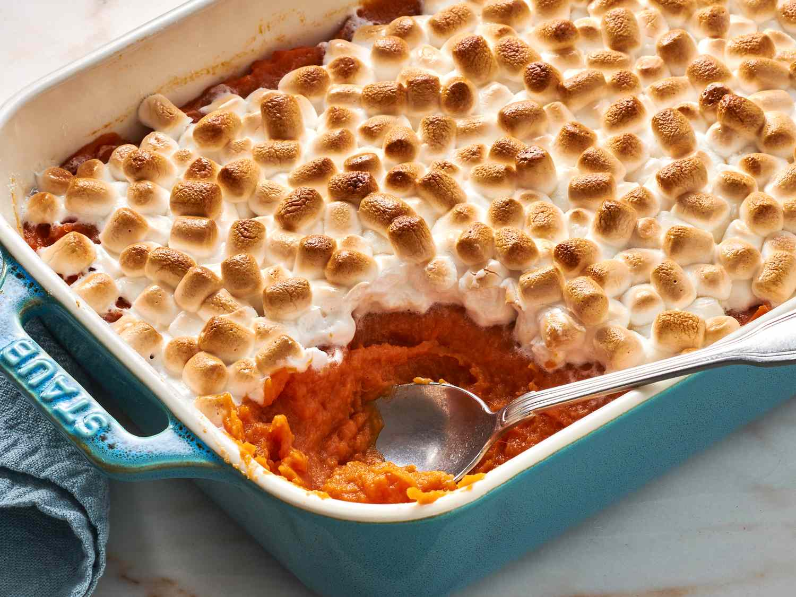

# Sweet Potato Casserole

📍 *Midwest — The Holiday Sideboard*

> Is it a side dish or dessert? The Midwest says yes to both. Silky mashed sweet potatoes kissed with warm spices, brown sugar, and vanilla, crowned with a toasted marshmallow dome and a pecan streusel that shatters on contact. This is the dish everyone secretly hopes you'll bring to Thanksgiving.

---

## At a Glance

| Detail | Info |
|--------|------|
| **Servings** | 10–12 |
| **Prep Time** | 30 minutes |
| **Cook Time** | 50 minutes |
| **Total Time** | 1 hour 20 minutes |
| **Difficulty** | Easy |
| **Category** | Sides |

---

## Ingredients

### The Sweet Potato Filling
- 4 pounds sweet potatoes (about 6 medium)
- ½ cup unsalted butter, softened
- ¾ cup packed light brown sugar
- ⅓ cup whole milk or heavy cream
- 2 large eggs, lightly beaten
- 2 teaspoons pure vanilla extract
- 1 teaspoon ground cinnamon
- ½ teaspoon ground nutmeg
- ¼ teaspoon ground ginger
- ½ teaspoon fine sea salt

### The Pecan Streusel Topping
- 1 cup chopped pecans
- ⅓ cup all-purpose flour
- ⅓ cup packed light brown sugar
- ¼ teaspoon ground cinnamon
- Pinch of fine sea salt
- 3 tablespoons unsalted butter, melted

### The Marshmallow Topping
- 3 cups mini marshmallows (or large marshmallows, halved)

---

## Instructions

1. **Cook the sweet potatoes.** Preheat oven to 400°F. Pierce sweet potatoes all over with a fork. Place on a foil-lined baking sheet and bake for 50–60 minutes until completely tender when pierced with a knife. (Alternatively, peel, cube, and boil in salted water for 15–20 minutes until tender, then drain well.)

2. **Prepare the filling.** Reduce oven to 350°F. Scoop the flesh from the baked sweet potatoes (discard skins) into a large bowl. While still hot, add butter and mash until smooth. Add brown sugar, milk, eggs, vanilla, cinnamon, nutmeg, ginger, and salt. Beat with an electric mixer until fluffy and smooth, about 2 minutes.

3. **Make the streusel.** In a medium bowl, combine pecans, flour, brown sugar, cinnamon, and salt. Drizzle with melted butter and toss with a fork until crumbly.

4. **Assemble.** Butter a 9x13-inch baking dish. Spread the sweet potato mixture evenly in the dish, smoothing the top.

5. **First bake.** Sprinkle the pecan streusel evenly over half of the casserole (this creates two topping zones). Bake for 25 minutes until the filling is set and the streusel is golden.

6. **Add marshmallows.** Remove from oven. Arrange marshmallows over the other half of the casserole (or sprinkle a layer over everything if you prefer). Return to oven for 8–10 minutes until marshmallows are puffed and beautifully golden brown.

7. **Broil for color (optional).** For extra toasty marshmallows, place under the broiler for 1–2 minutes. Watch constantly — they go from golden to burned in seconds.

8. **Serve immediately.** This casserole is best served warm, while the marshmallows are still soft and gooey.

---

## Tips & Variations

- **Best Sweet Potatoes:** Garnet or Jewel varieties (the ones with reddish-orange skin and deep orange flesh) have the sweetest flavor and creamiest texture.
- **Make Ahead:** Prepare the filling up to 2 days ahead and refrigerate. Bring to room temperature before topping and baking, adding 10 minutes to the bake time.
- **Streusel Only:** Skip the marshmallows entirely for a more sophisticated presentation. Cover the whole top with streusel.
- **Marshmallow Only:** The purists' version — just marshmallows, toasted to perfection.
- **Bourbon Addition:** Add 2 tablespoons bourbon to the filling for a grown-up twist.
- **Maple Version:** Replace brown sugar with pure maple syrup for a deeper, more complex sweetness.
- **Individual Portions:** Bake in ramekins for elegant single servings. Reduce bake time by 10 minutes.

---

## 🌾 Did You Know?

> The marshmallow-topped sweet potato casserole is a distinctly American invention, born in the early 1900s when the Angelus Marshmallow Company published a booklet of recipes to promote their product. The pairing caught on immediately, especially across the Midwest and South. By the 1950s, no Thanksgiving was complete without it. The great debate — marshmallows vs. streusel vs. both — has divided families for generations. Savvy Midwestern cooks learned to do half and half, keeping the peace while satisfying everyone. The dish sits in that delicious gray area between side and dessert, and honestly, no one's complaining.

---

*📸 Photography note: Rectangular ceramic baking dish with sweet potato casserole — half topped with golden toasted marshmallows, half with crunchy pecan streusel. A serving spoon reveals the creamy orange interior. Autumn leaves and small pumpkins in the background. Warm, cozy holiday lighting.*

---

## ⭐ Midwest Nice Rating

5/5 🫕🫕🫕🫕🫕 (Will diplomatically make half with marshmallows and half with streusel so nobody has to pick sides at Thanksgiving — family harmony is worth the extra effort.)

---

## 🥂 Pairs Well With

Pairs well with: Turkey and gravy, the great marshmallow-versus-streusel debate, and aunts who insist 'it's practically a vegetable.'

---

## 👵 Grandma's Secret: Sweet Potato Casserole

> "Grandma Evelyn always added a splash of fresh orange juice to her sweet potato filling. 'Brightens the whole thing right up,' she'd say, zesting a little orange peel on top before the marshmallows. 'Makes it taste like sunshine, even in November.'"
