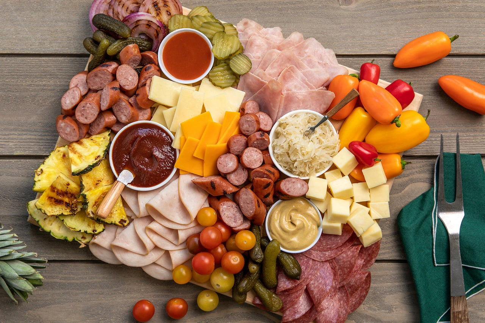

# Cheese and Sausage Board

📍 *Midwest — The Gathering Centerpiece*

> Forget fancy charcuterie — this is the Heartland version. Sharp Wisconsin cheddars, smoky summer sausage, tangy pickles, and hearty crackers arranged on a board that invites everyone to dig in. It's the appetizer that feels like home, perfect for football Sundays, holidays, and any excuse to gather.

---

## At a Glance

| Detail | Info |
|--------|------|
| **Servings** | 10–12 (as appetizer) |
| **Prep Time** | 20 minutes |
| **Cook Time** | None |
| **Total Time** | 20 minutes |
| **Difficulty** | Easy |
| **Category** | Snacks |

---

## Ingredients

### The Cheeses (choose 4–5)
- 8 oz sharp Wisconsin cheddar, cubed or sliced
- 8 oz Colby Jack cheese, cubed
- 6 oz smoked Gouda, wedge or sliced
- 4 oz creamy Havarti, sliced
- 6 oz Wisconsin brick cheese, cubed
- 4 oz cheese curds (fresh, squeaky ones!)

### The Meats (choose 2–3)
- 12 oz summer sausage, sliced into rounds
- 8 oz hard salami, sliced
- 6 oz beef sticks or snack sticks
- 8 oz smoked kielbasa, sliced on the bias

### The Accompaniments
- 1 cup whole grain mustard
- ½ cup honey (for drizzling)
- 1 cup dill pickle spears or chips
- 1 cup pickled jalapeños or giardiniera
- 1 cup green olives or mixed olives
- ½ cup dried cranberries
- ½ cup mixed nuts (almonds, cashews)

### The Vessels
- 1 sleeve buttery crackers (like Ritz)
- 1 sleeve wheat crackers
- 1 small baguette, sliced
- Pretzel crisps or soft pretzel bites

---

## Instructions

1. **Start with the board.** Choose a large wooden cutting board, slate board, or a big platter. Give yourself plenty of room — crowded boards are hard to navigate.

2. **Place the cheeses first.** Arrange cheeses in different areas of the board, leaving space between them. Cut some into cubes, leave others in wedges, and fan out slices. Variety in shape makes it more visually appealing and easier to grab.

3. **Add the meats.** Fold salami slices into quarters or roll them. Fan summer sausage in overlapping rows. Scatter beef sticks for casual grabbing. Place meats near their cheese companions.

4. **Add small bowls.** Place small bowls or ramekins on the board for mustard, honey, olives, and pickled items. This prevents runny items from making everything soggy.

5. **Fill the gaps.** Tuck crackers, bread slices, and pretzels into empty spaces around the edges and between items. Stack them or fan them for visual interest.

6. **Finish with pops of color.** Scatter dried cranberries, nuts, and fresh herbs (if desired) to fill remaining gaps and add color contrast.

7. **Provide tools.** Set out small cheese knives, toothpicks or small forks, and spreaders for the mustard.

8. **Serve at room temperature.** Remove from the refrigerator 20–30 minutes before serving. Cheese tastes best when not ice cold.

---

## Tips & Variations

- **Wisconsin Cheese Focus:** Stick to Wisconsin cheeses for the most authentic Heartland board — cheddar, Colby, brick, and fresh cheese curds are all made there.
- **Make It Local:** Visit a local cheese shop or farmer's market for artisanal cheeses from your region.
- **Summer Sausage:** Look for Usinger's, Klement's, or other Midwestern summer sausage brands for authenticity.
- **Kid-Friendly Section:** Reserve one corner with milder cheese, plain crackers, and grapes for young eaters.
- **Sweet Addition:** Add apple slices and grapes for freshness and color.
- **Spicy Version:** Include pepper Jack cheese, pickled jalapeños, and spicy mustard.
- **Make Ahead:** Cube cheeses and slice meats a day ahead. Refrigerate separately and assemble just before serving.
- **Holiday Board:** Add themed elements — cranberry sauce and turkey summer sausage for Thanksgiving, or festive picks for Christmas.

---

## 🌾 Did You Know?

> While coastal cities embraced the French-influenced "charcuterie board," the Midwest was already building its own version: the cheese and sausage board. Wisconsin, America's Dairyland, produces more cheese than any other state — over 3 billion pounds annually. German immigrants brought summer sausage and hard salami traditions, while Polish communities contributed kielbasa. The combination became a tailgating and holiday staple, appearing on coffee tables from Green Bay to Kansas City. Unlike fussy charcuterie with paper-thin prosciutto and imported Manchego, the Midwestern board is hearty and unpretentious — designed for big appetites and bigger gatherings. It says, "pull up a chair, grab a plate, and help yourself."

---

*📸 Photography note: Large wooden cutting board overflowing with colorful arrangement — golden cheddar cubes, white cheese curds, pink summer sausage rounds, crackers fanned out, small bowl of grainy mustard, green olives, dried cranberries scattered. Relaxed, inviting styling. Casual setting with football game on TV blurred in background. Warm, social lighting.*
