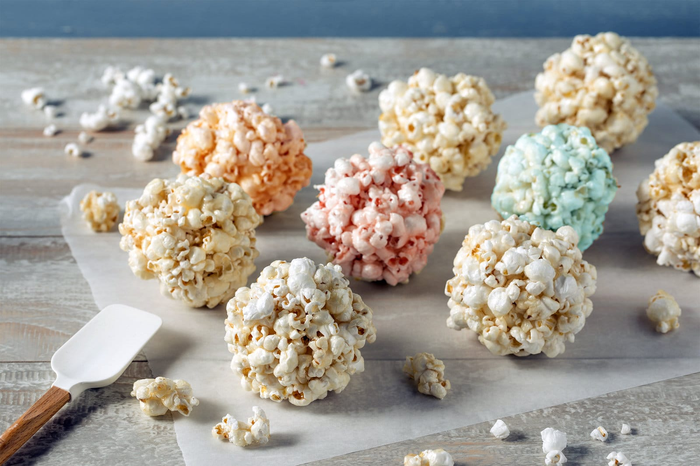

# Classic Popcorn Balls

📍 *Across the Midwest — Halloween, Harvest Festivals, and School Carnivals*

> Freshly popped corn held together by a warm, sticky, buttery-sweet syrup and shaped by greased hands into big, crunchy, slightly unwieldy spheres. Popcorn balls are the original Midwestern snack — older than your grandma, simpler than your toaster, and guaranteed to pull out at least one filling if you've got dental work.

---

## At a Glance

| Detail | Info |
|--------|------|
| **Yield** | 12–15 balls |
| **Prep Time** | 10 minutes |
| **Cook Time** | 10 minutes |
| **Total Time** | 30 minutes (including shaping) |
| **Difficulty** | Easy (but work fast) |
| **Category** | Snacks |

---

## 🫕 Midwest Nice Rating: 🫕🫕🫕🫕

Peak autumn energy. Popcorn balls are to October what cookies are to December. Every harvest festival, Halloween party, and school carnival has a table of these.

---

## Ingredients

- 12 cups freshly popped popcorn (about ½ cup unpopped kernels)
- 1 cup granulated sugar
- ⅓ cup light corn syrup
- ⅓ cup water
- ¼ cup (½ stick) unsalted butter
- ½ teaspoon white vinegar
- ½ teaspoon salt
- 1 teaspoon pure vanilla extract

---

## Instructions

1. **Pop the corn.** Pop your popcorn using whatever method you prefer — stovetop, air popper, or microwave (plain, not the buttered stuff). Remove all unpopped kernels — they are a tooth hazard and a lawsuit waiting to happen. Place the popped corn in a very large bowl, ideally the biggest one you own.

2. **Make the syrup.** In a medium heavy-bottomed saucepan, combine the sugar, corn syrup, water, butter, vinegar, and salt. Stir over medium heat until the sugar dissolves and the butter melts. Stop stirring once it comes to a boil. Let it boil, undisturbed, until a candy thermometer reads 250°F (hard-ball stage). This takes about 8–10 minutes. Watch it — syrup can go from perfect to burned in seconds.

3. **Add vanilla.** Remove the syrup from heat and carefully stir in the vanilla. It will bubble and steam. This is fine.

4. **Combine.** Pour the hot syrup over the popcorn and toss with a wooden spoon or rubber spatula, working quickly to coat as much popcorn as possible. Move fast — the syrup starts to set immediately.

5. **Shape.** As soon as the mixture is cool enough to handle (but still warm and pliable), grease your hands generously with butter or cooking spray. Grab a generous handful of the coated popcorn and press it firmly into a ball, roughly the size of a softball. Compact it enough to hold together but don't crush the popcorn. Set each ball on wax paper or parchment to cool.

6. **Cool and wrap.** Let the popcorn balls cool completely, about 15 minutes. Wrap individually in plastic wrap, wax paper, or cellophane for giving away. Or just leave them in a bowl and watch them disappear.

---

## Tips & Variations

- **Work FAST.** The syrup sets quickly. If it hardens before you've shaped all the balls, return the pot to low heat for a minute to re-melt, then continue. Having a helper for the shaping step is extremely useful.
- **Candy Thermometer Essential:** 250°F (hard-ball stage) is the sweet spot. Too low and the balls won't hold together. Too high and they'll be rock-hard and aggressive toward teeth.
- **Caramel Popcorn Balls:** Use brown sugar instead of white and increase the butter to ⅓ cup. The result is darker, more caramelly, and deeply addictive.
- **Autumn Harvest Version:** Add ½ cup candy corn, ½ cup pretzel pieces, and ½ cup peanuts to the popcorn before pouring the syrup. Festive, salty-sweet, and perfect for a fall party.
- **Marshmallow Popcorn Balls:** For a softer, chewier ball, melt 4 tablespoons of butter with a 10-oz bag of marshmallows instead of making the sugar syrup. Mix with popcorn and shape. Easier, softer, and kid-friendlier.
- **Food Coloring:** A few drops of food coloring in the syrup (orange for Halloween, red and green for Christmas) makes them festive.

---

> **🤫 Grandma's Secret:** *"Rub your hands with real butter, not cooking spray — the butter tastes better if any gets on the popcorn, and your hands stay softer. And pop the corn in coconut oil on the stovetop. It makes the popcorn taste like the movies. Microwave popcorn has no soul."*

---

## Pairs Well With

A hayride, a corn maze, the kind of crisp October evening where you can see your breath, and a mild but genuine concern about the structural integrity of your dental fillings.

---

## 🌾 Did You Know?

> Popcorn has deep Midwestern roots — quite literally. Iowa, Indiana, Illinois, and Nebraska are the top popcorn-producing states, and the Midwest grows the vast majority of the world's popcorn. The first commercial popcorn balls appeared in the late 1800s, when sugar syrup and popped corn came together in what was essentially the original American snack bar. They became a staple at fairs, carnivals, and holiday celebrations. During the early 20th century, popcorn balls were a common Halloween treat — neighbors would make them and hand them out to trick-or-treaters. This tradition faded with (largely unfounded) fears about tampered homemade treats, and popcorn balls were replaced by commercially wrapped candy. But in small towns across the Midwest, the tradition persists — you'll still find neighbors handing out popcorn balls on Halloween night, and nobody thinks twice about it, because in small towns, you know who made them and you trust their kitchen.

---

*📸 Photography note: A pile of golden popcorn balls on a sheet of wax paper, some wrapped in cellophane with twist-ties, some bare and showing the craggy popcorn texture. Maybe some autumn leaves or a small pumpkin in the background. Warm, harvest-season lighting. The photo should feel like an October kitchen counter.*
