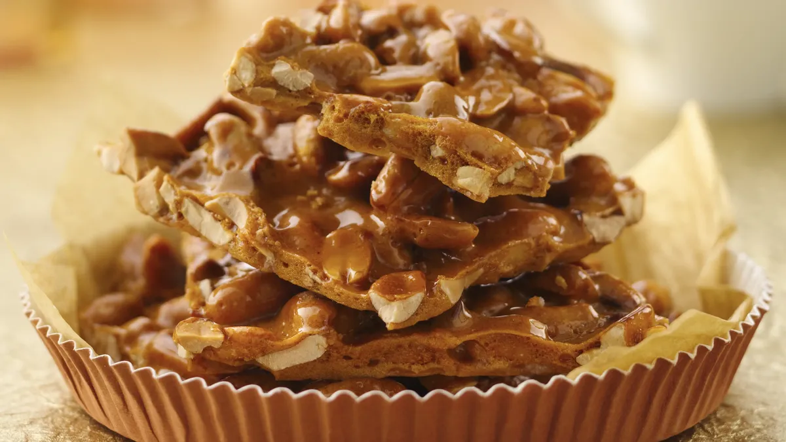

# Peanut Brittle

📍 *Across the Midwest — Holiday Tins, Gift Bags, and Grandma's Kitchen*

> A thin, shattering sheet of amber-gold caramelized sugar studded with roasted peanuts, snapped into jagged, glassy shards that crack between your teeth with a sound that's half candy, half destruction. Peanut brittle is the candy that makes you feel like a chemist, tastes like a holiday, and sounds like you're chewing gravel — in the best possible way.

---

## At a Glance

| Detail | Info |
|--------|------|
| **Yield** | About 1½ pounds |
| **Prep Time** | 5 minutes |
| **Cook Time** | 20–25 minutes |
| **Cool Time** | 30 minutes |
| **Total Time** | 1 hour |
| **Difficulty** | Moderate (candy thermometer required) |
| **Category** | Snacks / Candy |

---

## 🫕 Midwest Nice Rating: 🫕🫕🫕🫕

Christmas tin royalty. Peanut brittle in a decorative tin is the Midwest's most dignified edible gift, right alongside fudge and those butter cookies everyone keeps sewing supplies in.

---

## Ingredients

- 1½ cups granulated sugar
- ½ cup light corn syrup
- ¼ cup water
- ¼ teaspoon salt
- 1½ cups raw peanuts (skins on or off — your call)
- 2 tablespoons unsalted butter
- 1 teaspoon baking soda
- 1 teaspoon pure vanilla extract

---

## Instructions

1. **Prep your surface.** Line a large baking sheet with parchment paper or a silicone baking mat and grease it lightly with butter. Have the butter, baking soda, and vanilla measured and ready by the stove. Once the sugar hits temperature, you'll have about 30 seconds to add everything — this is not the time to search for the baking soda.

2. **Cook the sugar.** In a large heavy-bottomed saucepan, combine the sugar, corn syrup, water, and salt. Cook over medium heat, stirring constantly with a wooden spoon, until the sugar dissolves and the mixture begins to boil.

3. **Add the peanuts.** Once boiling, add the raw peanuts. Attach your candy thermometer and continue cooking, stirring frequently, until the mixture reaches 300°F (hard-crack stage). This takes 15–20 minutes. The mixture will go through stages — first foamy and white, then golden, then amber. The peanuts will darken and smell roasted. When it hits 300°F and the color is a warm amber-gold, move fast.

4. **The 30-second finish.** Remove from heat immediately. Working quickly, stir in the butter until melted, then add the baking soda and vanilla. The mixture will foam up dramatically and turn lighter and more opaque — this is the baking soda creating air bubbles, which is what makes the brittle light and crispy instead of dense and tooth-breaking.

5. **Pour and spread.** Immediately pour the mixture onto the prepared baking sheet. Using a greased spatula or the back of a greased wooden spoon, spread it as thin as possible. Work fast — it sets quickly. Thinner = crunchier and more elegant. Thicker = more rustic and chewy.

6. **Cool completely.** Let the brittle cool at room temperature for at least 30 minutes. It will harden as it cools. Once completely cool and rigid, break it into irregular shards by hand or by gently whacking it with the handle of a knife.

7. **Store.** Keep in an airtight container at room temperature, with pieces separated by wax paper. Properly stored, peanut brittle keeps for 2–3 weeks. Package in tins for gifting.

---

## Tips & Variations

- **Candy Thermometer is Non-Negotiable.** The difference between 290°F (chewy and underwhelming) and 310°F (burnt and bitter) is narrow. Use a thermometer. Clip it to the pot. Trust the numbers.
- **Raw Peanuts:** Use raw (not roasted) peanuts — they'll roast in the sugar syrup as it cooks. Pre-roasted peanuts will over-toast and taste bitter by the time the sugar reaches 300°F.
- **Baking Soda Magic:** The baking soda reacts with the acidic sugar syrup, creating thousands of tiny CO2 bubbles that make the brittle airy and light. Without it, you'd have peanut toffee — good but not brittle. Don't skip it.
- **Cashew Brittle:** Substitute cashews for peanuts. Add them later (at 275°F) since cashews are softer and burn more easily.
- **Spiced Brittle:** Add ¼ teaspoon cayenne pepper with the baking soda for a sweet-heat brittle that's dangerously addictive.
- **Microwave Method:** For beginners, there are microwave peanut brittle recipes that work surprisingly well. They won't have quite the same depth of caramelization, but they're much less intimidating.
- **Humidity Warning:** Peanut brittle absorbs moisture from the air. Don't make it on a rainy or humid day, and store it sealed. Soggy brittle is sad brittle.

---

> **🤫 Grandma's Secret:** *"Pull and stretch the brittle right after you pour it — grab the edges with greased hands and pull gently to make it thinner. Thinner brittle is always better. And a tiny pinch of cayenne pepper — just enough that people can't figure out why they can't stop eating it."*

---

## Pairs Well With

A Christmas tin that also contains fudge, peppermint bark, and those inexplicable ribbon candies nobody actually likes. The entire tin will be consumed by December 27th. The brittle will be gone first.

---

## 🌾 Did You Know?

> Peanut brittle is an American candy classic with murky origins — various legends attribute it to a Southern cook who accidentally added baking soda to taffy, a New England candy maker's experiment, or a Midwestern farm wife's adaptation of European nut confections. What's clear is that peanut brittle became a holiday staple across the Midwest by the early 20th century, aided by the region's abundance of corn syrup (a key ingredient) and its culture of homemade holiday candy-making. Before the era of commercial candy, families made their own: brittle, fudge, divinity, taffy, and hard candies. Peanut brittle was the showstopper — the candy that required skill, timing, and a certain fearlessness around boiling sugar. Making it was a rite of passage. Receiving a tin of someone's homemade brittle was (and is) a gesture of genuine affection. In the Midwest, where emotions are expressed through food rather than words, a tin of peanut brittle says "I care about you" in the clearest possible terms.

---

*📸 Photography note: Jagged shards of golden peanut brittle scattered on parchment paper, peanuts visible in the amber candy, some pieces stacked. Maybe a festive tin nearby, partially filled. Holiday lighting — warm, golden, cozy. The photo should look like a Christmas kitchen with candy cooling on the counter.*
