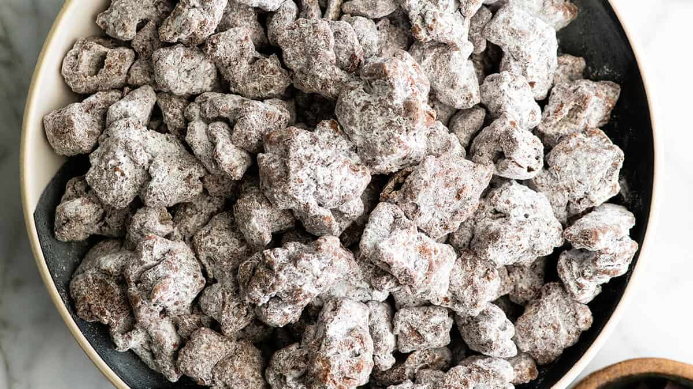

# Puppy Chow (Muddy Buddies)

📍 *Midwest — Every Kitchen, Every Party*

> Chex cereal coated in melted chocolate and peanut butter, then tumbled in a blizzard of powdered sugar until every piece is a sweet, crunchy, impossibly addictive little cloud. Call it Puppy Chow or Muddy Buddies — just don't think you can eat only one handful.

---

## At a Glance

| Detail | Info |
|--------|------|
| **Servings** | 12–16 (about 9 cups) |
| **Prep Time** | 10 minutes |
| **Cook Time** | 5 minutes |
| **Total Time** | 25 minutes (including cooling) |
| **Difficulty** | Easy |
| **Category** | Snacks |

---

## Ingredients

- 9 cups Rice Chex cereal (or Corn Chex — or a mix of both)
- 1 cup semi-sweet chocolate chips
- ½ cup creamy peanut butter
- ¼ cup unsalted butter
- 1 teaspoon pure vanilla extract
- 1½ cups powdered sugar

---

## Instructions

1. **Measure the cereal.** Pour 9 cups of Chex cereal into a very large bowl (the biggest you have — you need room to toss). Set aside.

2. **Melt the coating.** In a microwave-safe bowl, combine the chocolate chips, peanut butter, and butter. Microwave in 30-second intervals, stirring between each, until the mixture is completely smooth and glossy (usually about 90 seconds total). Stir in the vanilla extract.

3. **Coat the cereal.** Pour the warm chocolate-peanut butter mixture over the Chex cereal. Using a rubber spatula, gently fold and toss — be thorough but gentle. You want every piece coated, but you don't want to crush the cereal into crumbs. Take your time.

4. **The powdered sugar step.** This is where the magic happens. Pour the powdered sugar into a large gallon-sized zip-top bag (or a large paper grocery bag for the truly old-school method). Add the coated cereal to the bag. Seal it up and shake, shake, shake until every single piece is covered in a thick white coat of powdered sugar. The more you shake, the better it gets.

5. **Cool and dry.** Spread the puppy chow out on a large sheet of wax paper or parchment in a single layer. Let it cool completely, about 15 minutes. The chocolate will set and the coating will firm up.

6. **Devour.** Transfer to a big bowl and serve. Try to share. We believe in you.

---

## Tips & Variations

- **The Name Debate:** East of the Mississippi, it's generally "Puppy Chow." West and South, it's "Muddy Buddies" (which is also the official Chex brand name). In the heart of the Midwest, it's Puppy Chow, and this is a Midwest cookbook, so Puppy Chow it is.
- **Peanut-Free:** Substitute SunButter (sunflower seed butter) for the peanut butter to make it allergy-friendly. Works perfectly.
- **S'mores Version:** Add mini marshmallows and crushed graham crackers after the powdered sugar step.
- **Cookies & Cream:** Use white chocolate chips instead of semi-sweet, skip the peanut butter, and toss with crushed Oreos along with the powdered sugar.
- **Birthday Cake:** Use white chocolate, add rainbow sprinkles, and use a teaspoon of cake batter extract instead of vanilla.
- **Storage:** Keeps in an airtight container at room temperature for up to a week — but it has never once lasted that long in any household.
- **Pro Tip:** Double the batch. Always double the batch.

---

## 🌾 Did You Know?

> Puppy Chow's origins are murky, but it emerged from Midwestern kitchens sometime in the 1970s or 1980s, likely as a creative use of the Chex cereal that was already a staple for Chex Mix (another Midwest party legend). The name "Puppy Chow" comes from the finished product's resemblance to Purina Puppy Chow kibble — a comparison that sounds unappetizing until you taste it, at which point you stop caring about the name entirely. Puppy Chow is the universal Midwestern snack: it appears at birthday parties, holiday gatherings, school bake sales, movie nights, road trips, and "just because it's Tuesday." It requires no baking, no special skills, and approximately four minutes to make — which is good, because it takes approximately four minutes to disappear.

---

*📸 Photography note: A big red bowl overflowing with powdered-sugar-coated puppy chow, a few pieces spilled onto the table. Maybe a kid's hand reaching for a piece. Bright, cheerful, casual party lighting. Colorful napkins. Fun, approachable, snackable energy.*
