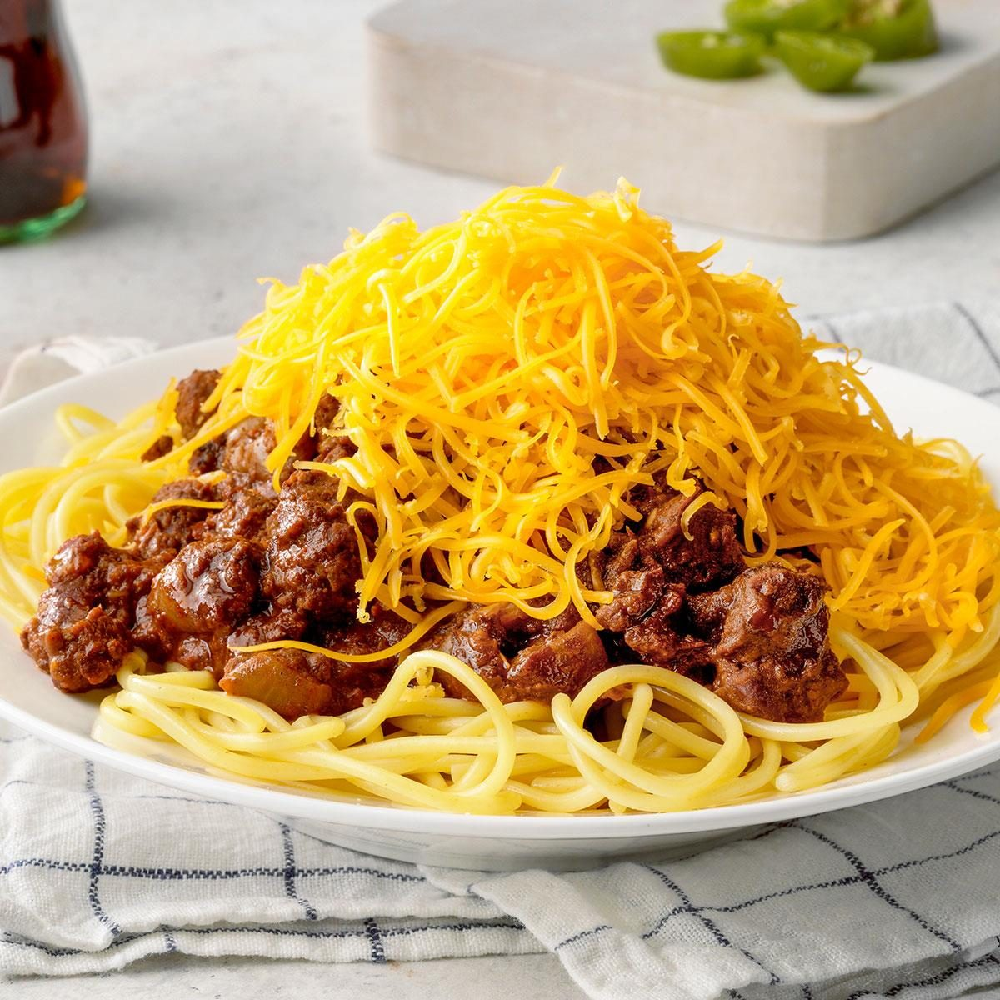

# Cincinnati Chili

📍 *Cincinnati, Ohio*

> Not your Texas chili and not your mama's spaghetti — Cincinnati chili is its own glorious thing: a cinnamon-and-cocoa-scented meat sauce ladled over spaghetti and buried under a mountain of finely shredded cheddar. Order it by the "Way" and argue about it forever.

---

## At a Glance

| Detail | Info |
|--------|------|
| **Servings** | 8 |
| **Prep Time** | 15 minutes |
| **Cook Time** | 2 hours |
| **Total Time** | 2 hours 15 minutes |
| **Difficulty** | Medium |
| **Category** | Soups & Stews / Mains |

---

## Ingredients

### The Chili
- 2 pounds ground beef (80/20)
- 1 quart water
- 1 can (6 ounces) tomato paste
- 2 tablespoons apple cider vinegar
- 2 tablespoons Worcestershire sauce
- 1 large yellow onion, finely diced (about 1½ cups)
- 4 cloves garlic, minced
- 2 tablespoons chili powder
- 1 tablespoon ground cumin
- 2 teaspoons ground cinnamon
- 1½ teaspoons ground allspice
- ½ teaspoon ground cloves
- ½ teaspoon cayenne pepper (adjust to taste)
- 1 tablespoon unsweetened cocoa powder
- 2 bay leaves
- 1 teaspoon fine sea salt
- ½ teaspoon freshly ground black pepper

### For Serving — Build Your "Way"
- 1 pound spaghetti, cooked and drained
- 2 cups finely shredded mild cheddar cheese (the finer the better)
- 1 large yellow onion, finely diced (raw)
- 1 can (15 ounces) kidney beans, drained and warmed
- Oyster crackers
- Hot sauce (optional)

---

## The Cincinnati "Ways" Serving Guide

| Way | What's On the Plate |
|-----|---------------------|
| **2-Way** | Spaghetti + Chili |
| **3-Way** | Spaghetti + Chili + Shredded Cheddar |
| **4-Way (Onion)** | Spaghetti + Chili + Onion + Cheddar |
| **4-Way (Bean)** | Spaghetti + Chili + Beans + Cheddar |
| **5-Way** | Spaghetti + Chili + Onion + Beans + Cheddar |

*Always build from the bottom up. Cheese goes on top — always on top — in an obscene mountain.*

---

## Instructions

1. **Boil the beef.** This is the key technique that makes Cincinnati chili unique. Place the ground beef in a large pot and cover with 1 quart of cold water. Stir and break up the meat as the water comes to a boil over medium-high heat. You want the meat to become very finely textured, almost like a sauce — no big chunks.

2. **Skim if needed.** Once boiling, reduce heat to medium. Some foam may rise to the surface; skim it off and discard.

3. **Add the aromatics and spices.** Stir in the diced onion, garlic, tomato paste, vinegar, Worcestershire sauce, chili powder, cumin, cinnamon, allspice, cloves, cayenne, cocoa powder, bay leaves, salt, and pepper. Stir well to combine everything.

4. **Simmer low and slow.** Reduce heat to low, partially cover, and simmer for 1½ to 2 hours, stirring occasionally. The chili should reduce and thicken to a saucy, not soupy, consistency. If it gets too thick, add a splash of water.

5. **Taste and adjust.** Cincinnati chili is all about balance — you should taste warmth from the cinnamon and allspice, a hint of chocolate depth from the cocoa, and a slow-building heat from the chili powder and cayenne. Adjust salt, cayenne, or vinegar as needed. Remove bay leaves.

6. **Cook the spaghetti.** While the chili finishes, cook spaghetti according to package directions. Drain well.

7. **Plate your Way.** Mound spaghetti on an oval plate. Ladle chili generously over the top. Add your chosen toppings in order (beans, then onions, then cheese). The cheese should completely blanket the top — in Cincinnati, moderation is not a virtue when it comes to cheese.

8. **Serve with oyster crackers** and hot sauce on the side.

---

## Tips & Variations

- **The Boil Method Matters:** Boiling the beef in water (rather than browning it) gives Cincinnati chili its signature fine, sauce-like texture. Don't skip this step.
- **Make It Ahead:** Cincinnati chili tastes even better the next day as the spices meld. Refrigerate overnight and reheat.
- **Cheese Matters:** Use the finest shred setting on your box grater, or buy the pre-shredded "fine" cheddar. The fine shreds melt into the hot chili beautifully.
- **Coney Dogs:** Ladle the chili over a hot dog in a steamed bun, top with shredded cheese, diced onion, and yellow mustard for a classic Coney.
- **Freeze It:** Chili freezes beautifully for up to 3 months. Freeze in individual portions for quick weeknight dinners.

---

## 🌾 Did You Know?

> Cincinnati chili was invented in 1922 by Macedonian immigrant Tom Kiradjieff, who ran a hot dog stand called Empress. Drawing on Mediterranean and Middle Eastern spice traditions — the cinnamon, allspice, and cloves that seem unusual in American chili — he created something entirely new. The dish spread through a network of competing "chili parlors," with Skyline (founded 1949) and Gold Star (founded 1965) becoming the most famous. Today, Cincinnati has more chili parlors per capita than any city has of any single type of restaurant. Locals are fiercely loyal to their preferred parlor, and the 2-Way through 5-Way ordering system is taught to every Cincinnati child before they learn to ride a bike.

---

*📸 Photography note: Oval plate with a generous 5-Way — spaghetti barely visible under rich chili, diced white onion, kidney beans, and an absurd mountain of finely shredded cheddar cheese. Oyster crackers scattered nearby. Overhead shot on a Formica-style diner counter. Bright, slightly retro diner lighting.*
