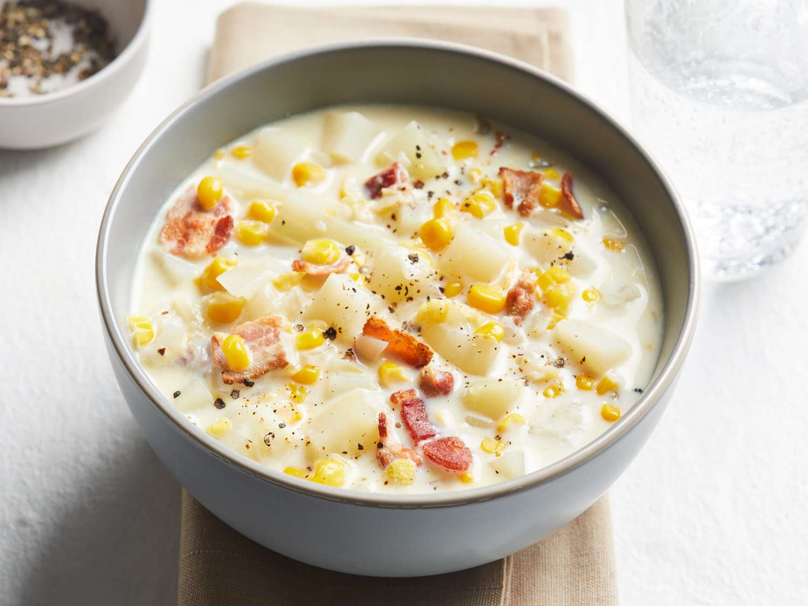

# Corn Chowder

📍 *Iowa*

> This is Iowa in a bowl: sweet corn so fresh it still tastes like August sunshine, swimming in cream with smoky bacon and tender potatoes. It's the soup that celebrates the reason Iowans endure miles of endless cornfields — because when corn is this good, you forgive it for blocking every horizon from June to October.

---

## At a Glance

| Detail | Info |
|---|---|
| **Servings** | 6-8 |
| **Prep Time** | 15 minutes |
| **Cook Time** | 30-35 minutes |
| **Total Time** | 45-50 minutes |
| **Difficulty** | Easy |
| **Category** | Soups |

---

## Ingredients

- 6 slices thick-cut bacon, diced
- 1 large yellow onion, finely chopped
- 2 celery stalks, diced
- 2 cloves garlic, minced
- 3 large russet potatoes (about 1.5 lbs / 680g), peeled and diced into ½-inch cubes
- 4 cups (960ml) chicken broth
- 4 cups (600g) corn kernels (fresh from about 6 ears, frozen, or canned and drained)
- 1 cup (240ml) heavy cream or half-and-half
- ½ tsp dried thyme
- Salt and freshly ground black pepper to taste
- Fresh chives, chopped, for garnish (optional)

## Instructions

1. **Cook Bacon:** In a large Dutch oven or heavy-bottomed pot, cook diced bacon over medium heat until crispy. Remove bacon with a slotted spoon and set aside on paper towels. Leave about 2 tablespoons of bacon drippings in the pot.
2. **Sauté Aromatics:** Add chopped onion and celery to the bacon drippings. Cook over medium heat, stirring occasionally, until softened, about 5-7 minutes. Add minced garlic and cook for 1 minute more.
3. **Add Potatoes & Broth:** Add the diced potatoes and chicken broth. Bring to a boil, then reduce heat and simmer for 10-15 minutes, or until potatoes are tender.
4. **Add Corn:** Stir in the corn kernels and dried thyme. Simmer for an additional 5-10 minutes.
5. **Thicken (Optional):** For a thicker chowder, use a potato masher to mash some of the potatoes directly in the pot, or ladle out 1-2 cups of the soup, blend until smooth, and return to the pot.
6. **Add Cream:** Stir in the heavy cream (or half-and-half). Heat through gently without boiling. Season with salt and freshly ground black pepper to taste.
7. **Serve:** Ladle the hot corn chowder into bowls. Garnish with reserved crispy bacon bits and fresh chopped chives, if desired. Serve immediately.

---

## Tips & Variations

- For a spicier chowder, add a pinch of cayenne pepper or a dash of hot sauce along with the other seasonings.
- To make it a hearty main course, add cooked, shredded chicken or ham during the last 10 minutes of simmering.
- If using fresh corn, consider scraping the "milk" from the cobs after removing the kernels for extra corn flavor in the broth.
- For an even richer base, a small pat of butter can be added at the end.

---

## 🌾 Did You Know?

> Iowa doesn't just grow corn — it *is* corn. With over 13 million acres planted annually (that's 90% of the state's farmland), Iowa produces more corn than most countries. The Iowa State Fair's annual Corn Dog competition and Blue Ribbon Foundation's sweet corn stands serve thousands of ears daily, roasted right on the grounds. But corn chowder has deeper roots: it was a practical farmhouse meal during late summer harvest, when corn was abundant and field hands needed hearty, filling food. Many Iowa families have their own "detasseling summer" memories — teenagers walking cornfields to remove tassels for seed production, then coming home to big pots of corn chowder made from the day's harvest. The tradition of cutting kernels fresh from the cob and scraping the "corn milk" into the pot is pure Iowa ingenuity — waste nothing, especially when it adds flavor. County extension cookbooks from the 1950s-70s are filled with corn chowder variations, each claiming to be the "original" farm recipe.

---

*📸 Photography note: Rustic farmhouse style. A deep, earthenware bowl filled with creamy corn chowder, garnished with crispy bacon bits and fresh green chives. A few kernels of corn and potato cubes are visible. The bowl is set on a worn wooden table, possibly with a subtle linen napkin. Soft, warm overhead lighting highlights the texture and steam.*

---

## ⭐ Midwest Nice Rating

4/5 🫕🫕🫕🫕
(Will bring a large pot to your house after a chilly fall day, insisting you have "just one more bowl.")

---

## 🥂 Pairs Well With

Pairs well with: A crisp autumn evening, a visit to a local corn maze, and the warm glow of a harvest moon.

---

## 👵 Grandma's Secret: Corn Chowder

> "Grandma Dorothy always added a secret ingredient: a spoonful of **pickled jalapeño juice** (about a teaspoon!) right before serving. 'It gives it a little zing,' she'd declare, 'that makes all those sweet corn flavors pop!'"
