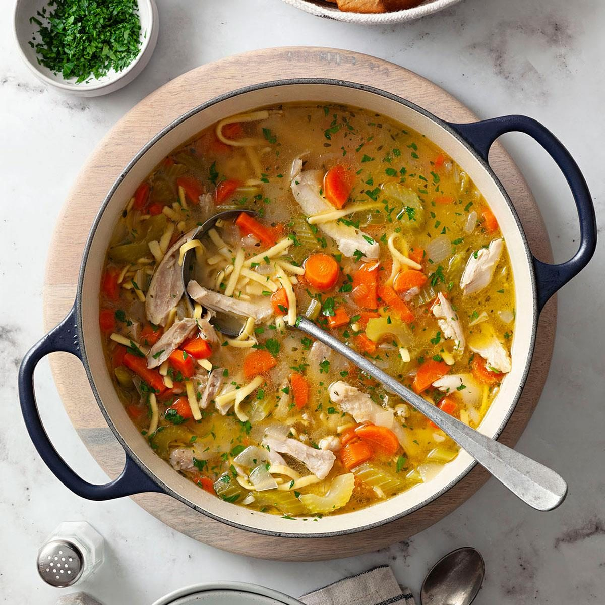

# Hearty Chicken Noodle Soup

📍 *Midwest — Every Kitchen, Every Cold Day*

> The Midwest's answer to everything: a cold snap, a bad day, a stuffy nose, or just a Wednesday in February. Wide egg noodles swimming in rich golden broth with tender chicken, chunky vegetables, and enough warmth to thaw you from the inside out.

---

## At a Glance

| Detail | Info |
|--------|------|
| **Servings** | 8 |
| **Prep Time** | 20 minutes |
| **Cook Time** | 1 hour 15 minutes |
| **Total Time** | 1 hour 35 minutes |
| **Difficulty** | Easy |
| **Category** | Soups |

---

## Ingredients

### The Soup
- 1 whole chicken (about 4 pounds), or 3 pounds bone-in, skin-on chicken thighs and breasts
- 12 cups cold water
- 3 tablespoons unsalted butter
- 2 large carrots, peeled and diced (about 1 cup)
- 3 stalks celery, diced (about 1 cup)
- 1 large yellow onion, diced (about 1½ cups)
- 4 cloves garlic, minced
- 2 bay leaves
- 4 sprigs fresh thyme (or 1 teaspoon dried thyme)
- 1 tablespoon fresh parsley, chopped, plus more for garnish
- 8 ounces wide egg noodles
- 1 tablespoon apple cider vinegar
- Salt and freshly ground black pepper to taste

---

## Instructions

1. **Simmer the chicken.** Place the whole chicken (or chicken pieces) in a large stockpot. Cover with 12 cups cold water. Bring to a boil over high heat, then immediately reduce to a gentle simmer. Skim off any foam that rises to the surface. Add the bay leaves and thyme sprigs. Partially cover and simmer gently for 45 minutes to 1 hour, until the chicken is cooked through and falling-off-the-bone tender.

2. **Remove and shred the chicken.** Using tongs, carefully transfer the chicken to a large cutting board. Let it cool enough to handle, about 10 minutes. Shred the meat into bite-sized pieces, discarding the skin and bones. Set the shredded chicken aside.

3. **Strain the broth.** Strain the broth through a fine-mesh sieve into a large bowl or clean pot. Discard the bay leaves and thyme stems. You should have about 10 cups of rich, golden broth. (If less, add chicken broth to supplement.)

4. **Cook the vegetables.** In the same pot (wiped clean), melt the butter over medium heat. Add the carrots, celery, and onion. Cook, stirring occasionally, until the vegetables are softened but not browned, about 8–10 minutes. Add the garlic and cook 1 minute more.

5. **Combine broth and vegetables.** Pour the strained broth back into the pot with the vegetables. Bring to a boil.

6. **Cook the noodles.** Add the egg noodles and cook according to package directions (usually 6–8 minutes), until tender.

7. **Add the chicken.** Stir the shredded chicken back into the soup. Add the apple cider vinegar (it brightens the whole pot). Season generously with salt and pepper — chicken soup needs more salt than you think.

8. **Serve.** Ladle into deep bowls and garnish with fresh chopped parsley. Serve with crusty bread, saltine crackers, or oyster crackers.

---

## Tips & Variations

- **The Homemade Broth Difference:** Making the broth from the whole chicken as part of the process is what gives this soup its soul. Shortcuts exist, but they're not the same.
- **Noodle Options:** Wide egg noodles are classic Midwest, but you can use homemade noodles (rolled and cut into strips) for the ultimate version. Some families use dumplings instead.
- **Rotisserie Shortcut:** In a hurry? Use a store-bought rotisserie chicken and 10 cups of good-quality chicken broth. Shred the meat and simmer with the vegetables.
- **Freezing:** Freeze the soup WITHOUT the noodles (they'll turn mushy). Cook fresh noodles when you reheat.
- **Add More Vegetables:** Diced potatoes, corn, peas, or green beans all work beautifully.
- **Extra Richness:** Stir in 2 tablespoons of heavy cream at the end for a luxurious finish.

---

## 🌾 Did You Know?

> The Midwest's devotion to chicken noodle soup runs deeper than comfort — it's practical. Historically, farm families kept chickens for eggs, and when a hen stopped laying, she went into the soup pot. The long simmering of a tougher old hen produced the richest, most flavorful broth. Wide egg noodles became the Midwest's noodle of choice because German and Eastern European immigrants brought their noodle-making traditions with them, and egg noodles held up beautifully in broth. Today, the Campbell's Soup plant in Napoleon, Ohio, produces a significant portion of America's canned chicken noodle soup — but every Midwesterner knows that nothing compares to homemade.

---

*📸 Photography note: Deep ceramic bowl filled with golden soup, wide egg noodles visible, chunks of chicken and bright orange carrots. A spoon lifting a noodle. Shot from a slight angle on a wooden table. Crusty bread and a cloth napkin alongside. Warm, steamy, comforting winter light from a nearby window.*
