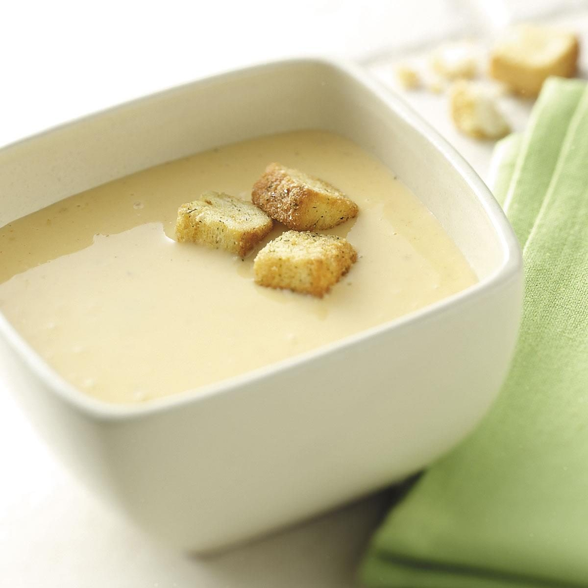

# Wisconsin Beer Cheese Soup

📍 *Wisconsin*

> Two of Wisconsin's greatest exports — beer and cheese — in one bowl. This is a thick, velvety soup that tastes like a warm hug from a dairy farmer. It's the kind of soup that makes you understand why people voluntarily live through Wisconsin winters.

---

## At a Glance

| | |
|---|---|
| **Servings** | 6–8 |
| **Prep Time** | 15 minutes |
| **Cook Time** | 30 minutes |
| **Total Time** | 45 minutes |
| **Difficulty** | Medium |
| **Category** | Soups & Stews |

---

## Ingredients

- 4 tablespoons unsalted butter
- 1 medium onion, finely diced
- 2 carrots, finely diced
- 2 stalks celery, finely diced
- 2 cloves garlic, minced
- ¼ cup all-purpose flour
- 2 cups chicken broth
- 1 cup whole milk
- 1 cup heavy cream
- 12 oz beer (a Wisconsin amber lager or pale ale — nothing too hoppy)
- 4 cups shredded sharp cheddar cheese (about 1 lb)
- 1 tablespoon Dijon mustard
- 1 teaspoon Worcestershire sauce
- ½ teaspoon smoked paprika
- Salt and white pepper to taste
- Dash of hot sauce *(optional)*

### Garnish
- Crumbled bacon
- Chopped chives or green onions
- Soft pretzel pieces or croutons
- Extra shredded cheese

---

## Instructions

1. **Sauté aromatics:** Melt butter in a large Dutch oven over medium heat. Add onion, carrots, and celery. Cook 6–7 minutes until softened. Add garlic, cook 1 minute.
2. **Make the roux:** Sprinkle flour over vegetables and stir constantly for 2 minutes to cook out the raw flour taste.
3. **Add liquids:** Slowly pour in chicken broth while stirring. Then add milk and cream. Bring to a gentle simmer, stirring occasionally, for 10 minutes until slightly thickened.
4. **Add beer:** Pour in the beer. It will foam — stir through it. Simmer 5 minutes.
5. **Add cheese:** Reduce heat to low. Add cheddar a handful at a time, stirring until each addition is melted before adding more. Do not boil — boiling makes cheese grainy.
6. **Season:** Stir in Dijon, Worcestershire, paprika, salt, white pepper, and hot sauce if using.
7. **Blend (optional):** For silky-smooth soup, use an immersion blender. For rustic texture, leave as-is.
8. **Serve** in bowls topped with crumbled bacon, chives, and pretzel pieces.

---

## Tips & Variations

- **Cheese selection:** Sharp or extra-sharp cheddar is essential for flavor. Pre-shredded cheese has anti-caking agents that prevent smooth melting — shred your own from a block.
- **Beer choice matters:** A malty amber or pale ale works best. IPAs are too bitter. Stouts are too heavy. When in doubt, Spotted Cow.
- **Low heat with the cheese:** This is the most important step. High heat + cheese = grainy, broken soup.
- **Pretzel bowls:** Serve in hollowed-out pretzel bread bowls for the full Wisconsin experience.
- **Broccoli addition:** Add 2 cups steamed broccoli florets for a broccoli-beer-cheese variation.

---

## 🌾 Did You Know?

Wisconsin is home to more than 1,200 licensed cheesemakers — more than any other state. The tradition of beer cheese soup likely evolved from German and Swiss immigrant cooking traditions that merged with Wisconsin's booming dairy and brewing industries. It's a staple at Friday fish fries (another Wisconsin institution) and appears on menus from supper clubs to stadium concessions. Wisconsin is so proud of its cheese heritage that it remains the only state where you can earn a "Master Cheesemaker" certification — a program that takes a minimum of 12 years to complete.

---

*📸 Photography note: Rustic farmhouse style — thick creamy soup in a stoneware bowl, crumbled bacon and chives on top, pretzel bread on the side. Wooden table, amber backlight suggesting a cozy pub setting.*
